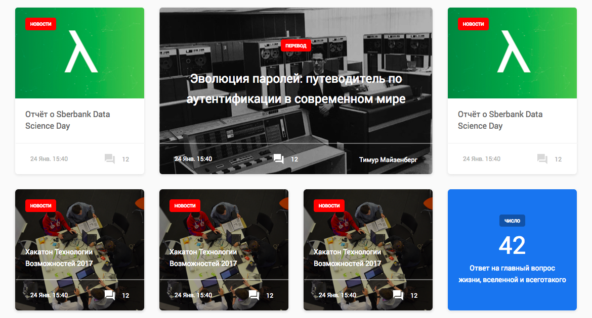

<h1>Карточки новостей</h1>



<h4>Карточка большая</h5>


```html
<div class="card card--big" style="background-image: url('img/card/big_card_img.png')">
        <a href="#" class="card__link">
            <div class="card-content">
                <div class="card-head--big">
                    <span class="card-head__tag card-head__tag--big "> перевод </span>
                </div>
                <div class="card-body card-body--big">
                    <div class="card-body__title card-body__title--big">
                        Эволюция паролей: путеводитель по
                        аутентификации в современном мире
                    </div>
                </div>
                <div class="card-footer card-footer--big">
                    <div class="card-footer__datetime card-footer__datetime--big">
                        24 Янв. 15:40
                    </div>
                    <div class="card-footer__countcomment card-footer__countcomment--big">
                        <span class="icon icon-close-comment-24--white"></span>
                        <span class="card-footer__countcomment__number">12</span>
                    </div>
                    <div class="card-footer__author">
                        Тимур Майзенберг
                    </div>
                </div>
            </div>
        </a>
</div>
    
```


