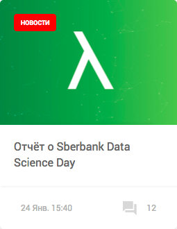
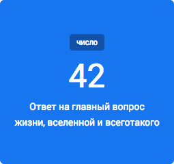

<h1>Карточки новостей</h1>


<h4>Карточка большая</h4>


```html
<div class="card card--big" style="background-image: url('img/card/big_card_img.png')">
    <a href="#" class="card__link">
        <div class="card-content">
            <div class="card-head--big">
                <span class="card-head__tag card-head__tag--big "> перевод </span>
            </div>
            <div class="card-body card-body--big">
                <div class="card-body__title card-body__title--big">
                    Эволюция паролей: путеводитель по
                    аутентификации в современном мире
                </div>
            </div>
            <div class="card-footer card-footer--big">
                <div class="card-footer__datetime card-footer__datetime--big">
                    24 Янв. 15:40
                </div>
                <div class="card-footer__countcomment card-footer__countcomment--big">
                    <span class="card-footer__icon card-footer__icon--white icon icon-comment"></span>
                    <span class="card-footer__countcomment__number">12</span>
                </div>
                <div class="card-footer__author">
                    Тимур Майзенберг
                </div>
            </div>
        </div>
    </a>
</div>  
```

<h4>Карточка средняя</h4>


```html
<div class="card card--middle">
    <a href="#" class="card__link">
        <div class="card-head--middle">
			<span class="card-head__tag card-head__tag--middle">
				новости
			</span>
            
        </div>
        <div class="card-body card-body--middle">
            <div class="card-body__title card-body__title--middle">
                Отчёт о Sberbank Data Science Day
            </div>
        </div>

        <div class="card-footer card-footer--middle">
            <div class="card-footer__datetime card-footer__datetime--middle">
                24 Янв. 15:40
            </div>
            <div class="card-footer__countcomment card-footer__countcomment--middle">
                <span class="card-footer__icon  icon icon-comment"></span>
                <span class="card-footer__countcomment__number">12</span>
            </div>
        </div>
    </a>
</div>
```
<h4>Карточка маленькая</h4>


```html
<div class="card card--small" style="background-image: url('img/card/big_card_img.png')">
    <a href="#" class="card__link">
        <div class="card-content" style="position: relative;width:100%;height: 100%;">
            <div class="card-head--small">
            <span class="card-head__tag card-head__tag--small ">
				перевод
			</span>
            </div>
            <div class="card-body card-body--small">
                <div class="card-body__title card-body__title--small">
                    Эволюция паролей: путеводитель по аутентификации в современном мире
                </div>
            </div>
            <div class="card-footer card-footer--big">
                <div class="card-footer__datetime card-footer__datetime--small">
                    24 Янв. 15:40
                </div>
                <div class="card-footer__countcomment card-footer__countcomment--small">
                    <span class="card-footer__icon card-footer__icon--white icon icon-comment"></span>
                    <span class="card-footer__countcomment__number">12</span>
                </div>
            </div>
        </div>
    </a>
</div>
```

<h4>Карточка чисел</h4>


```html
<div class="card card--number">
    <div class="card-head--number">
        <span class="card-head__tag card-head__tag--number ">
		    Число
		</span>
    </div>
    <div class="card-body__title card-body__title--number">
        42
    </div>
    <div class="card-description">
        Ответ на главный вопрос жизни, вселенной и всеготакого
    </div>
</div>
```